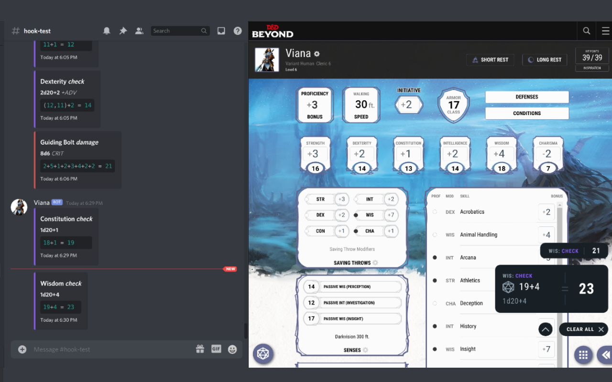

# Beyond Discord

A browser extension that sends dice roll results from D&D-Beyond to Discord using webhooks.

## Install

Chrome: <https://chrome.google.com/webstore/detail/beyond-discord/ljkjmgadfjdjamnnbeeohakojjcmfpka>

## Usage

1. Navigate to one of your dnd-beyond characters.
2. Click on the extension icon.
3. Click on "Configure". This will open the options page for the extension.
4. Follow the steps on screen to generate a webhook (in discord), and paste the webhook URL in the given input field.
5. Use dnd-beyond as normal. Any rolls made on the page will now be sent to discord using the provided webhook.

## Build the Source

1. `npm install`
2. `npm run start`

The complete extension can be found in `./public`, with any generated source in `./public/js`.
